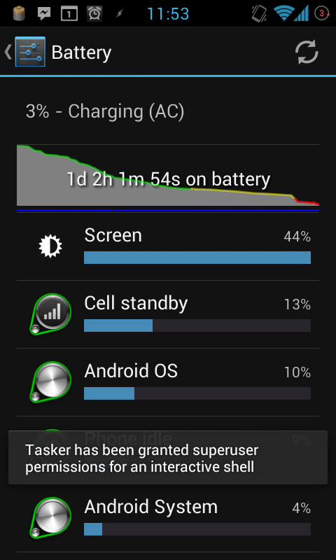

# Android CPU Control [v5.0]
***

`Android CPU Control` is a simple app created with the Tasker App Factory. It aims to improve the battery life of android devices. It adjusts your processor frequency and also disables mobile data and wifi when the screen is off. 
*Root Only*

**Note**: This was created and tested on a Galaxy S2, and testing ceased after the newer battery techniques employed on Android 4.0+. Use at your own risk.

### Screenshot

Without this app I got about 8 hour of battery life. With this app I managed a record of 25 hours, on moderate usage.

### Installation

Sideload the APK and install. 

### Usage

You don't have to do anything: it just works. There is a logfile in the SDcard that will inform you of various events.

### FAQ

> Is this safe to use?

Possibly. It has only been tested on a Galaxy S2 running Android 2.3.

> Do you plan to continue work on this?

No, there are other apps on the market that do this much better. This was a simple exercise in using Tasker App Factory.

#### License

`Android CPU Control` is licensed with GPL. 

#### Contributors

Ivan Smirnov  
Created using the [ Tasker App Factory ](https://play.google.com/store/apps/details?id=net.dinglisch.android.appfactory) 
